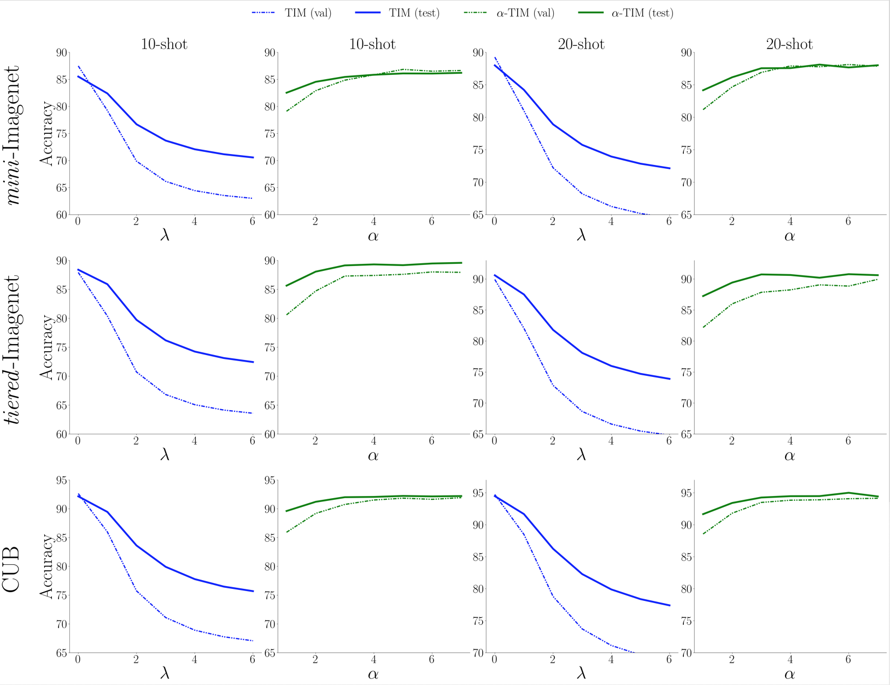

# Figure A - Accuracy of all methods versus Dirichlet parameter

# Figure B - Simplex plot of Dirichlet(0.5,0.5,0.5)

# Figure C - Comparison between Dirichlet / Step / Linear

Step imbalance corresponds to one of the following repartition of samples [1, 9, 9] or [1, 1, 9] or [1, 1, 1]
Linear imbalance corresponds to all viables distributions (at least 1 sample in each class) with a total of 15 samples, e.g [5 - i, 5, 5 + i] for i <= 4.

# Figure D - Correlation between optimal alpha and a

# Figure E - Plot for 10 and 20-shot

