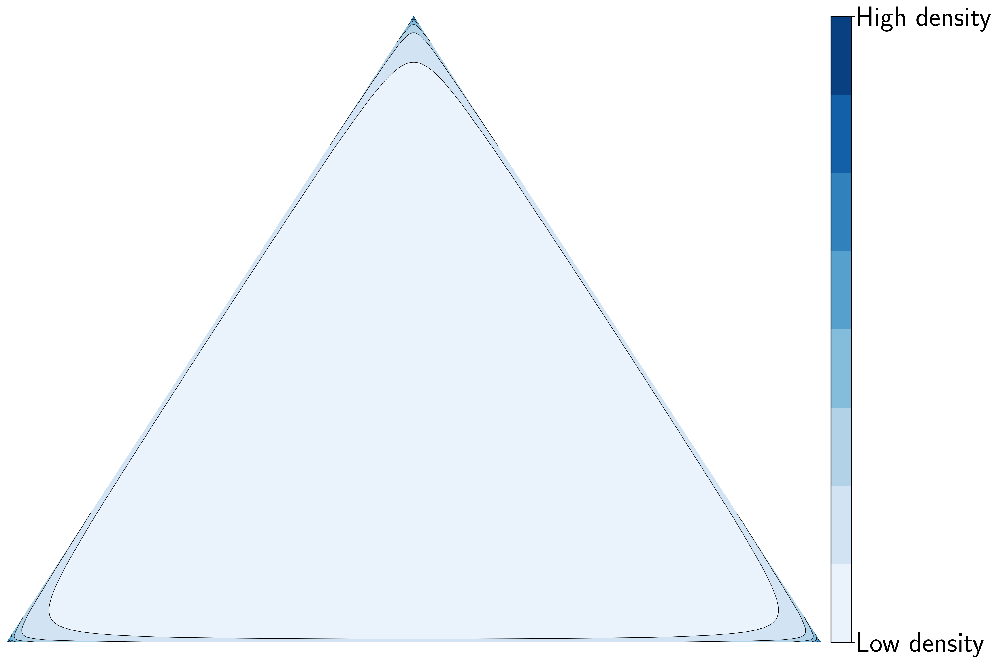
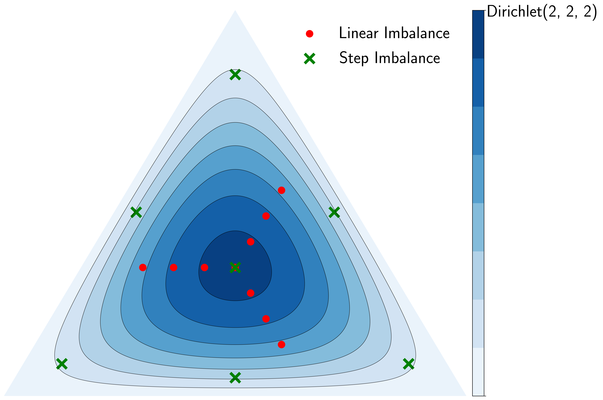
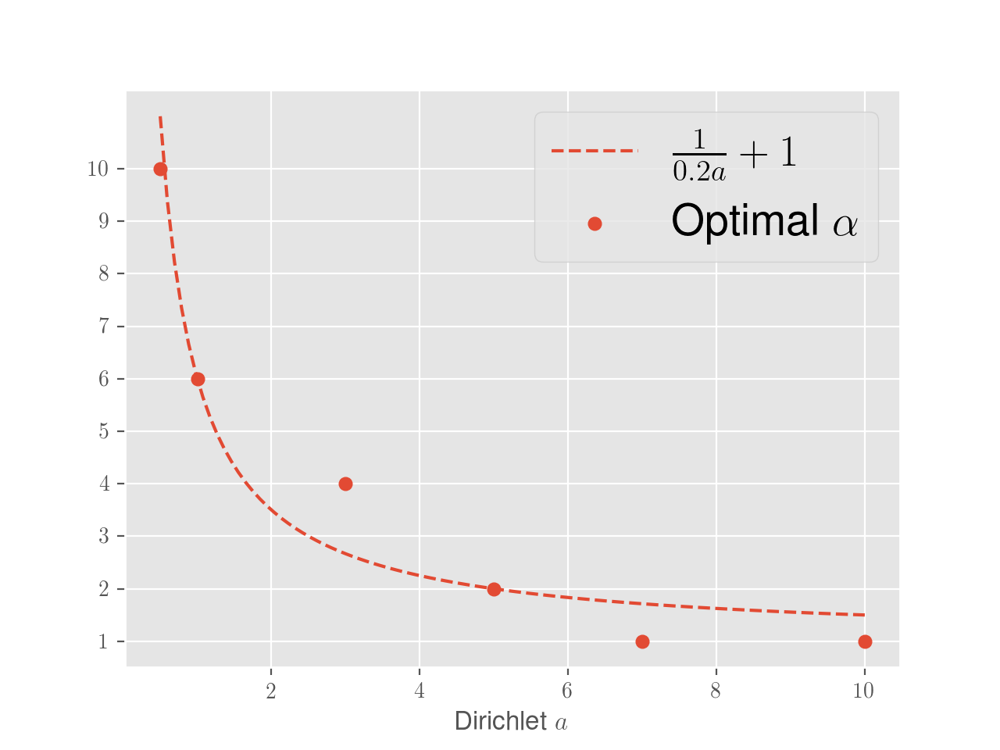

# Figure A - Accuracy of all methods versus Dirichlet parameter

TBD

# Figure B - Simplex plot of Dirichlet(0.5,0.5,0.5)

# Figure C - Comparison between Dirichlet / Step / Linear

# Figure D - Correlation between optimal alpha and a

# Figure E - Plot for 10 and 20-shot

TBD
